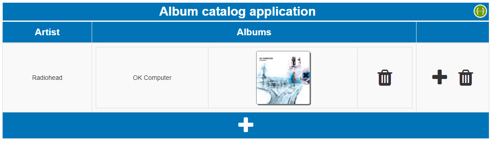
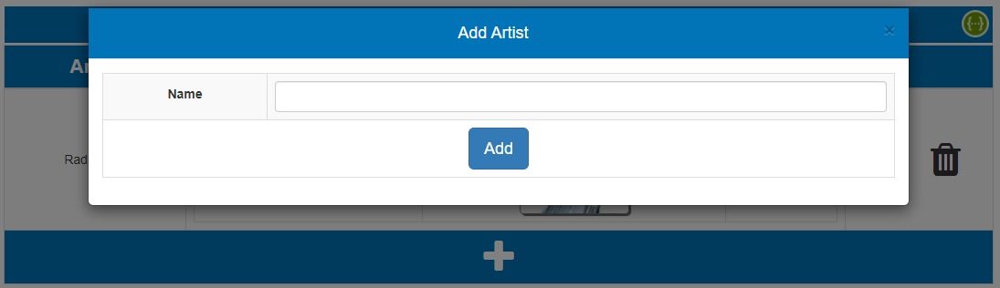
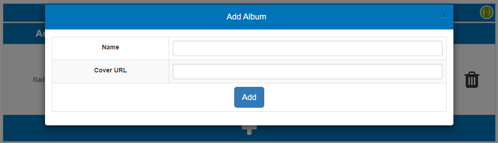
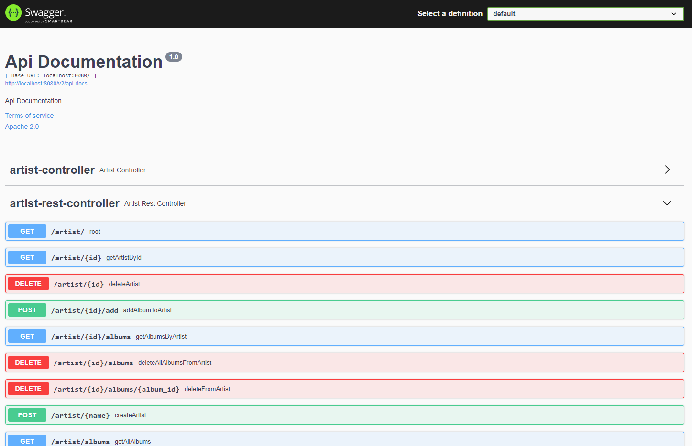

# Album catalog web application
**Spring Boot** application using **Thymeleaf** view to build an album catalog capable of:

-   Create a new artist
-   Delete an artist
-   Add a new album to an artist
-   Delete an album from a artist

# Running the application
Download the project and extract the contents to a folder.
Once Java is installed, please run the following command to start the application:

**For Linux/Macintosh**
```
 cd <extracted-folder>
 ./gradlew clean build bootRun
 ```
**For Windows**
```
cd <extracted-folder>
gradlew clean build bootRun
 ```
For deploying the application onto another web server, we can build the project using the following command and host the `albumcatalog-0.0.1-SNAPSHOT.war` that gets generated after building under `build/libs`.

**For Linux/Macintosh**
```
cd <extracted-folder>
./gradlew clean build
 ```
  **For Windows**
```
cd <extracted-folder>
gradlew clean build
 ```

By default, the application will run on `8080`, which can be changed using the property `server.port` in `src/main/resources/application.properties`. To access the application UI, open [http://localhost:8080](http://localhost:8080/) on any browser.



The following form will be displayed to add a new artist when clicking on the “+” button at the bottom:



The following form will be displayed to add an album to an artist when clicking on the “+” button next to the album:



# Using Swagger
To access Swagger UI, click on the Swagger icon at the top right corner. The following page will be opened where we can try out and execute the APIs.

